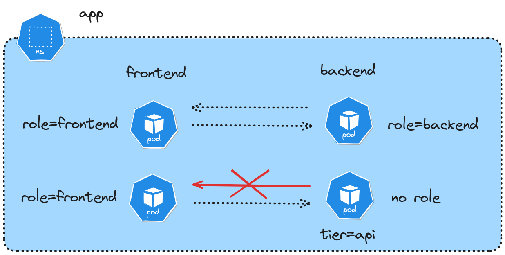

In this exercise, you will configure network policies to control traffic flow between two deployments in a Kubernetes cluster. You'll need to ensure specific pods can communicate based on their labels while blocking unauthorized traffic.



First, create a namespace called "app", create two deployments:
1. Frontend:
   - Deployment "frontend" with 2 replicas running nginx:1.20
2. Backend:
   - Deployment "backend" with 2 replicas running leskis/default-go

::simple-task
---
:tasks: tasks
:name: verify_deployments
---
#active
Waiting for deployments to be created...

#completed
Great! Both deployments are running correctly.
::

::hint-box
---
:summary: Hint 1
---
```bash
# Create namespace
kubectl create namespace app

# Create deployments
kubectl create deployment app -n app --image=nginx:1.20 --replicas=2
kubectl create deployment backend -n app --image=leskis/default-go --replicas=2
```
::

Now, label the pods:
1. All frontend pods should have: role=frontend
2. All backend pods should have: tier=api
3. Only one backend pod should have the additional label: role=backend

::simple-task
---
:tasks: tasks
:name: verify_labels
---
#active
Checking for correct pod labels...

#completed
Perfect! All pods are properly labeled.
::

::hint-box
---
:summary: Hint 2
---
```bash
# Label all frontend pods
kubectl label pods -n app -l app=app role=frontend

# Label all backend pods with tier=api
kubectl label pods -n app -l app=backend tier=api

# Get the name of one backend pod
BACKEND_POD=$(kubectl get pods -n app -l app=backend -o jsonpath='{.items[0].metadata.name}')

# Add role=backend label to just that one pod
kubectl label pod -n app $BACKEND_POD role=backend
```
::

Finally, create network policies to ensure:
1. All frontend pods can send traffic to any backend pod with label tier=api on port 8000
2. Only the backend pod with label role=backend can send traffic to frontend pods with label role=frontend on port 80
3. All other traffic should be denied by default

::simple-task
---
:tasks: tasks
:name: verify_network_policies
---
#active
Verifying network policies and testing connectivity...

#completed
Excellent! The network policies are correctly configured and enforcing the desired traffic patterns.
::

::hint-box
---
:summary: Hint 3
---
Create two network policies:
```yaml
apiVersion: networking.k8s.io/v1
kind: NetworkPolicy
metadata:
  name: frontend-to-backend
  namespace: app
spec:
  podSelector:
    matchLabels:
      tier: api
  ingress:
  - from:
    - podSelector:
        matchLabels:
          role: frontend
    ports:
    - port: 8000
      protocol: TCP
---
apiVersion: networking.k8s.io/v1
kind: NetworkPolicy
metadata:
  name: backend-to-frontend
  namespace: app
spec:
  podSelector:
    matchLabels:
      role: frontend
  ingress:
  - from:
    - podSelector:
        matchLabels:
          role: backend
    ports:
    - port: 80
      protocol: TCP
```
::
