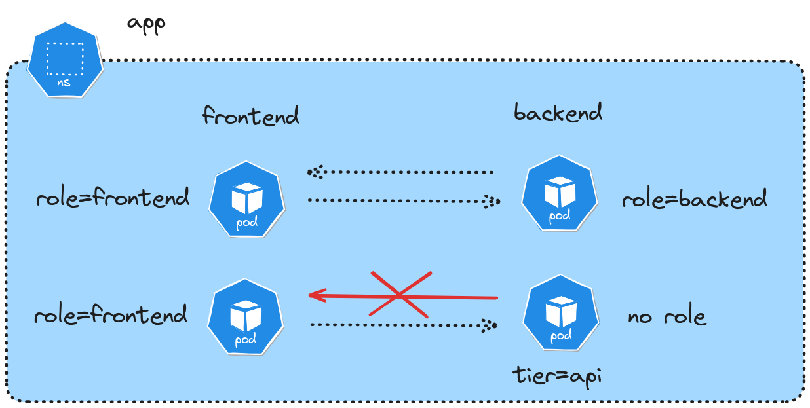

In this exercise, you will configure network policies to control traffic flow between two deployments in a Kubernetes cluster. You'll need to ensure specific pods can communicate based on their labels while blocking unauthorized traffic. Have fun!



First, create a namespace called "app":

::simple-task
---
:tasks: tasks
:name: verify_namespace
---
#active
Waiting for namespace to be created...

#completed
Good, the namespace is ready to go.
::


::hint-box
---
:summary: Hint 1
---
Check the [documentation for creating namespaces](https://kubernetes.io/docs/reference/generated/kubectl/kubectl-commands#-em-namespace-em-)
::

Now, create two deployments in that namespace.


1. Frontend:
   - Deployment "frontend" with 2 replicas running `nginx:1.20`
   - Accessible on port 80
2. Backend:
   - Deployment "backend" with 2 replicas running `leskis/default-go`
   - Accessible on port 8000

::simple-task
---
:tasks: tasks
:name: verify_deployment_frontend
---
#active
Waiting for frontend deployment to be created...

#completed
Great! Frontend deployment is running correctly.
::

::simple-task
---
:tasks: tasks
:name: verify_deployment_backend
---
#active
Waiting for backend deployment to be created...

#completed
Great! Backend deployment is running correctly.
::

::hint-box
---
:summary: Hint 2
---
Check the [documentation for creating deployments](https://kubernetes.io/docs/reference/generated/kubectl/kubectl-commands#-em-deployment-em-)
::

Now, label the pods:
1. All frontend pods should have: `role=frontend`
2. All backend pods should have: `tier=api`
3. Only one backend pod should have the additional label: `role=backend`

::simple-task
---
:tasks: tasks
:name: verify_labels
---
#active
Checking for correct pod labels...

#completed
Perfect! All pods are properly labeled.
::

::hint-box
---
:summary: Hint 3
---
Check the [documentation for adding labels](https://kubernetes.io/docs/reference/generated/kubectl/kubectl-commands#label)
::

::hint-box
---
:summary: Hint 4
---
```bash
# Get the name of one backend pod
BACKEND_POD=$(kubectl get pods -n app -l app=backend -o jsonpath='{.items[0].metadata.name}')
```
::

Finally, create network policies to make sure:
1. All frontend pods can send traffic to any backend pod with label `tier=api` on port 8000
2. Only the backend pod with label `role=backend` can send traffic to frontend pods with label `role=frontend` on port 80
3. All other traffic should be denied by default

::simple-task
---
:tasks: tasks
:name: verify_network_policies
---
#active
Verifying network policies and testing connectivity...

#completed
Excellent! The network policies are correctly configured and enforcing the desired traffic patterns.
::

::hint-box
---
:summary: Hint 5
---
Create two network policies, one for the frontend => backend, and another from the backend => frontend. Here's the first one:
```yaml
apiVersion: networking.k8s.io/v1
kind: NetworkPolicy
metadata:
  name: frontend-to-backend
  namespace: app
spec:
  podSelector:
    matchLabels:
      tier: api
  ingress:
  - from:
    - podSelector:
        matchLabels:
          role: frontend
    ports:
    - port: 8000
      protocol: TCP
```
::
